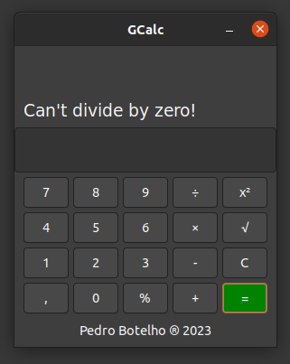

# Dio's C/C++ Developer Training Projects

Projects made for the C/C++ Developer Training, by **Digital Innovation One** (Dio). In these projects, I try to take the idea of the project challenges and bring it up a notch, like adding GTK+ and Qt.

## 1\# GCalc

A functional calculator, using C, CMake, a little CSS, GTK+ and Glade. I've tried copying the Linux calculator appearance, and I think it went well. 

In the future I expect to modify some things to make it even better (I kinda made it in one day, so it was rushed)!

